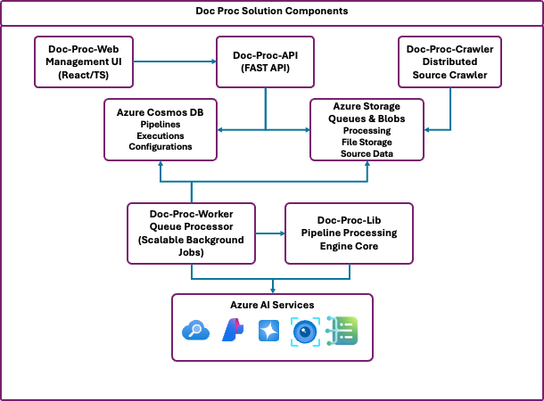

<p align="center">
    <picture>
    
    </picture>
</p>

# Document Processing Solution Accelerator

A comprehensive, enterprise-ready document processing solution built on Azure that enables organizations to rapidly deploy and scale document processing workflows. This accelerator combines the power of Azure AI services, cloud-native architecture, and modern development practices to provide a complete platform for document ingestion, processing, and analysis.

## 🚀 What is this Solution Accelerator?

This solution accelerator provides a production-ready foundation for building document processing applications on Azure. It includes:

- **Modular Processing Pipeline**: A flexible Python library (`doc-proc-lib`) for creating custom document processing workflows
- **Web-based Management UI**: React + TypeScript frontend (`doc-proc-web`) for managing pipelines, services, and monitoring executions
- **Scalable Worker Architecture**: High-performance background worker service (`doc-proc-worker`) with Azure Storage Queue integration
- **Data Source Crawler**: Scalable background worker service for crawling and retrieving content from sources (`doc-proc-crawler`)
- **RESTful API Backend**: FastAPI-based service (`doc-proc-api`) with Azure Cosmos DB for data persistence
- **Infrastructure as Code**: Bicep templates for automated Azure deployment (`doc-proc-deploy`)


### **[Getting Started →](#getting-started)**

## ✨ Key Benefits

- **🏃‍♂️ Rapid Development**: Get started with document processing in minutes, not months
- **🔧 Highly Configurable**: Modular architecture allows customization without core changes
- **☁️ Cloud-Native**: Built specifically for Azure with best practices and security in mind
- **📊 Production-Ready**: Includes monitoring, logging, error handling, and scalability features
- **🔌 Extensible**: Easy to integrate with existing systems and add custom processing steps
- **💰 Cost-Effective**: Optimized resource usage with serverless and managed services

## 🏗️ Architecture Overview

The solution consists of the following building blocks:

<picture>
  <source media="(prefers-color-scheme: dark)" srcset="./assets/diagram-1-dark.png">
  
</picture>

## 📦 Core Components

### 🔧 doc-proc-lib
**The Processing Engine** - A flexible Python library that serves as the heart of the document processing pipeline.

- **Modular Architecture**: Catalog-based configuration for services, steps, and pipelines
- **Azure Integration**: Built-in connectors for Blob Storage, AI Document Intelligence, OpenAI, and more
- **Async Processing**: High-performance asynchronous processing capabilities
- **Custom Components**: Easy framework for building custom processing steps and service integrations
- **Environment Management**: Comprehensive configuration management with environment-specific settings

📖 **[View detailed documentation →](./doc-proc-lib/README.md)**

### 🎨 doc-proc-web
**The Management Interface** - A modern React-based web application for managing and monitoring document processing workflows.

- **Technology Stack**: React 18 + TypeScript + Vite
- **UI Framework**: Radix UI components with Tailwind CSS styling
- **Features**:
  - Pipeline configuration and management
  - Service and step catalog administration
  - Real-time execution monitoring
  - Interactive workflow designer
  - Responsive design for desktop and mobile

📖 **[View detailed documentation →](./doc-proc-web/README.md)**

### 🚀 doc-proc-api
**The Backend API** - FastAPI-based service providing RESTful APIs for document processing operations.

- **Technology Stack**: FastAPI + Python with Azure Cosmos DB
- **Features**:
  - RESTful API for all CRUD operations
  - Service catalog management
  - Step catalog management  
  - Pipeline configuration and execution
  - Health monitoring and diagnostics
  - CORS-enabled for web client integration
  - Azure App Configuration integration
  - Comprehensive error handling and validation

📖 **[View detailed documentation →](./doc-proc-api/README.md)**

### ⚡ doc-proc-worker
**The Processing Engine** - High-performance background processing service for executing document processing jobs at scale.

- **Technology Stack**: Python with Azure Storage Queue integration
- **Key Features**:
  - Asynchronous queue processing with Azure Storage Queues
  - Pipeline execution with step-by-step orchestration
  - Batch processing with progress tracking and error recovery
  - Multiprocessing support for CPU-intensive workloads
  - Fault tolerance with retry mechanisms and graceful degradation
  - Health monitoring with automatic restart capabilities
  - Cloud-native Azure integration

📖 **[View detailed documentation →](./doc-proc-worker/README.md)**

### 🔍 doc-proc-crawler
**The Document Discovery Engine** - Intelligent distributed crawler service for automated document discovery and ingestion from various sources.

- **Technology Stack**: Python with Azure Cosmos DB and distributed coordination
- **Key Features**:
  - Distributed coordination with lease-based conflict prevention
  - Automatic source discovery from Cosmos DB configuration
  - Multi-source support (file systems, cloud storage, databases, APIs)
  - Intelligent load balancing across multiple deployment instances
  - Self-healing operations with automatic restart and error recovery
  - Configurable crawling schedules and polling intervals
  - Metadata extraction and content indexing
  - Integration with document processing pipelines

📖 **[View detailed documentation →](./doc-proc-crawler/README.md)**

### 🏗️ doc-proc-deploy
**Infrastructure as Code** - Automated deployment templates and scripts for Azure resources.

- **Bicep Templates**: Complete infrastructure provisioning with Azure Bicep
- **Automated Scripts**: Shell scripts for streamlined deployment process
- **Resource Provisioning**: Container Apps, Container Registry, Cosmos DB, Storage Accounts, App Configuration
- **Environment Configuration**: Support for multiple environments (dev, staging, prod)
- **CI/CD Ready**: Scripts designed for integration with automated pipelines

📖 **[View deployment documentation →](./doc-proc-deploy/README.md)**

## 💡 Use Cases and Scenarios

This solution accelerator can be applied across various industries and document processing workflows. Below are common use cases with domain-specific examples and configuration patterns.


### 📄 Multi-Modal Document Processing

#### **Enterprise Content Unification**
Process diverse document types and formats in a unified workflow with intelligent format detection and specialized extraction:

```
┌─────────────────┐    ┌─────────────────┐    ┌─────────────────┐    ┌─────────────────┐
│  Mixed Content  │───▶│  Format         │───▶│  Specialized    │───▶│  Unified Data   │
│  Repository     │    │  Detection      │    │  Extraction     │    │  Structure      │
└─────────────────┘    └─────────────────┘    └─────────────────┘    └─────────────────┘
```

**Supported Document Types:**
- **Structured PDFs**: Forms, invoices, contracts with precise field extraction
- **Scanned Images**: Historical documents, handwritten forms with OCR processing
- **Office Documents**: Word, Excel, PowerPoint with native content extraction
- **Email Archives**: Outlook PST/MSG files with attachment processing
- **Web Content**: HTML pages, online forms with content scraping
- **Audio/Video**: Meeting recordings, training materials with transcription

**Intelligent Processing Pipeline:**
- **Format Detection**: Automatic MIME type detection and content analysis
- **Content Routing**: Route documents to specialized extraction services based on format
- **Cross-Reference Linking**: Connect related documents across different formats
- **Metadata Harmonization**: Standardize metadata across diverse document types
- **Quality Validation**: Ensure extraction accuracy with confidence scoring

**Key Benefits:**
- **Format Agnostic**: Single pipeline handles any document type
- **Intelligent Routing**: Automatic selection of optimal processing methods
- **Preservation of Context**: Maintain relationships between multi-format document sets
- **Scalable Processing**: Parallel processing of different formats simultaneously


### 🏢 Financial Services

#### **Invoice Processing Automation**
Streamline accounts payable workflows with automated invoice processing:

```
┌─────────────────┐    ┌─────────────────┐    ┌─────────────────┐    ┌─────────────────┐
│   PDF/Email     │───▶│  Document AI    │───▶│   Validation    │───▶│   ERP System    │
│   Invoice       │    │   Extraction    │    │   & Approval    │    │   Integration   │
└─────────────────┘    └─────────────────┘    └─────────────────┘    └─────────────────┘
```

#### **Loan Document Processing**
Accelerate loan application processing with document verification:

- **Bank Statements**: Extract transaction history, balance verification, income calculation
- **Tax Returns**: Parse tax forms, verify income sources, calculate debt-to-income ratios
- **Employment Letters**: Extract salary information, employment status, tenure

#### **Automated Document Ingestion**
Enterprise-scale document discovery and ingestion with intelligent coordination:

```
┌─────────────────┐    ┌─────────────────┐    ┌─────────────────┐    ┌─────────────────┐
│   File Shares   │───▶│   Distributed   │───▶│   Document      │───▶│   Processing    │
│   Cloud Storage │    │    Crawler      │    │   Queue         │    │   Pipeline      │
│   API Endpoints │    │   Discovery     │    │   Management    │    │   Execution     │
└─────────────────┘    └─────────────────┘    └─────────────────┘    └─────────────────┘
```

**Key Benefits:**
- **Multi-Source Support**: Automatically discover and ingest from file systems, SharePoint, cloud storage, databases, and REST APIs
- **Distributed Coordination**: Multiple crawler instances work together with lease-based coordination to prevent duplicates
- **Smart Scheduling**: Configurable polling intervals and change detection for efficient resource usage
- **Self-Healing**: Automatic restart of failed processes and graceful handling of source availability

### 🏥 Healthcare

#### **Medical Records Digitization**
Transform paper-based medical records into structured digital formats:

```
┌─────────────────┐    ┌─────────────────┐    ┌─────────────────┐    ┌─────────────────┐
│  Scanned Chart  │───▶│      OCR +      │───▶│   FHIR Data     │───▶│      EHR        │
│   Documents     │    │   Medical AI    │    │   Mapping       │    │   Integration   │
└─────────────────┘    └─────────────────┘    └─────────────────┘    └─────────────────┘
```

#### **Clinical Trial Document Processing**
Process research documents and patient data for clinical trials:

- **Consent Forms**: Extract patient consent status, trial parameters
- **Case Report Forms**: Structure clinical observations and measurements
- **Adverse Event Reports**: Parse safety data for regulatory compliance

### ⚖️ Legal Services

#### **Contract Analysis and Review**
Automate contract review processes with AI-powered analysis:

```
┌─────────────────┐    ┌─────────────────┐    ┌─────────────────┐    ┌─────────────────┐
│   Contract      │───▶│  Clause         │───▶│  Risk Analysis  │───▶│  Review         │
│   Document      │    │  Extraction     │    │  & Compliance   │    │  Dashboard      │
└─────────────────┘    └─────────────────┘    └─────────────────┘    └─────────────────┘
```


#### **Legal Discovery Document Processing**
Process large volumes of documents for litigation support:

- **Email Processing**: Extract metadata, identify privileged communications
- **Document Classification**: Categorize documents by relevance and privilege
- **Redaction**: Automatically redact sensitive information

### 🏭 Manufacturing & Supply Chain

#### **Quality Control Documentation**
Process inspection reports, certificates, and compliance documents:

```
┌─────────────────┐    ┌─────────────────┐    ┌─────────────────┐    ┌─────────────────┐
│  Inspection     │───▶│  Data           │───▶│  Compliance     │───▶│  Quality        │
│  Reports        │    │  Extraction     │    │  Verification   │    │  Dashboard      │
└─────────────────┘    └─────────────────┘    └─────────────────┘    └─────────────────┘
```

#### **Supplier Document Management**
- **Certificates of Compliance**: Verify supplier certifications and standards
- **Material Safety Data Sheets**: Extract safety information for regulatory compliance
- **Purchase Orders**: Process and validate supplier documentation


## Getting Started

### Prerequisites

Before getting started, ensure you have the following:

**Deployment/Development Environment:**
- Python 3.11+ with pip
- Node.js 18+ with npm (required for building front-end)
- Docker Desktop (optional, for containerized development)
- Git for version control
- Azure CLI (required for Azure deployment)
- Powershell Version 7.0 or higher (if using powershell scripts for deployment)
- bash (if using bash scripts for deployment)

**Azure Resources:**
- Azure subscription with appropriate permissions
- Resource group with required permissions (Contributor and User Access Administrator)  
- Azure AI Model Deployment Quota for AI services

### Quick Start Options

Choose the deployment method that best fits your needs:

#### ☁️ **Azure Cloud Deployment**
Production-ready deployment on Azure with full scalability:

**Using Powershell for deployment**
```powershell
# 0. Clone the repository
git clone https://github.com/Azure/doc-proc-solution-accelerator.git
cd doc-proc-solution-accelerator

# 1. Deploy Azure infrastructure (AI Foundry, Container Apps, Cosmos DB, Storage Account, etc.)
pwsh .\doc-proc-deploy\DeployAzureInfra.ps1 -ResourceGroup myResourceGroup -Location westus -p docproc

# 2. Build and push Docker images to Azure Container Registry
pwsh .\doc-proc-deploy\BuildAndPushImages.ps1 -Registry myregistry.azurecr.io -Tag latest

# 3. Deploy applications to Azure Container Apps
pwsh .\doc-proc-deploy\DeployApps.ps1 -ResourceGroup myResourceGroup
```

**Using shell scripts for deployment**
```bash
# 0. Clone the repository
git clone https://github.com/Azure/doc-proc-solution-accelerator.git
cd doc-proc-solution-accelerator

# 1. Deploy Azure infrastructure (AI Foundry, Container Apps, Cosmos DB, Storage Account, etc.)
./doc-proc-deploy/deploy-azure-infra.sh -g myResourceGroup -l westus -p docproc

# 2. Build and push Docker images to Azure Container Registry
./doc-proc-deploy/build-and-push-images.sh -r myregistry.azurecr.io -t latest

# 3. Deploy applications to Azure Container Apps
./doc-proc-deploy/deploy-apps.sh -g myResourceGroup
```

This creates:
- **Azure Container Registry** for storing Docker images
- **Azure Container Apps** for hosting API, Web, worker, and crawler services
- **Azure Cosmos DB** for configuration data persistence
- **Azure Storage Account** for queue management and blob storage
- **Azure App Configuration** for centralized configuration management
- **Azure AI Foundry** for AI Services

#### 🔧 **Local Development**
Once the Azure resources are deployed, you can run the solution services locally for development:

```pwsh
cd doc-proc-solution-accelerator

# Configure environment variables for each service
# Copy .env.example to .env and update with your Azure resource endpoints
cp doc-proc-api\.env.example doc-proc-api\.env
cp doc-proc-worker\.env.example doc-proc-worker\.env
cp doc-proc-crawler\.env.example doc-proc-crawler\.env
cp doc-proc-web\.env.example doc-proc-web\.env

# Edit the .env files with your Azure resource information:
# doc-proc-api\.env - Add Azure App Configuration endpoint
# doc-proc-worker\.env - Add Azure App Configuration endpoint
# doc-proc-crawler\.env - Add Azure App Configuration endpoint
# doc-proc-web\.env - Update API base URL if different from http://localhost:8090

# Start all services locally with auto-reload
pwsh .\doc-proc-deploy\StartServicesLocally.ps1

#./doc-proc-deploy/start-services-locally.sh  # if using shell

```

**Required Configuration Values:**
- `AZURE_APP_CONFIG_ENDPOINT`: Endpoint URL (format: `https://<app-config-name>.azconfig.io`)
- `VITE_API_BASE_URL`: API endpoint for the web application (default: `http://localhost:8090`)

This will start:
- **API Server**: http://localhost:8090 (FastAPI backend)
- **Web Application**: http://localhost:8080 (React frontend)
- **Worker Service**: Background processing service
- **Crawler Service**: Document discovery and ingestion service


💡 **For detailed instructions and additional options, see the [comprehensive deployment guide →](./doc-proc-deploy/README.md)**


### 📊 Monitoring and Scaling

#### Auto-Scaling Configuration

Container Apps are configured with intelligent auto-scaling:

- **HTTP-based scaling**: Scales based on concurrent requests
- **Queue-based scaling**: Worker scales based on queue depth
- **CPU/Memory scaling**: Scales based on resource utilization

#### Health Monitoring

All services include comprehensive health monitoring:
- **Health check endpoints** for Container Apps
- **Application Insights integration** for telemetry
- **Log Analytics workspace** for centralized logging

### 🔐 Security Features

- **Managed Identity**: Services use managed identities for Azure resource access
- **Network isolation**: Container Apps Environment with virtual network integration
- **HTTPS enforcement**: All endpoints secured with SSL/TLS

## 🏷️ Repository Structure

```
doc-proc-solution-accelerator/
├── doc-proc-lib/              # 🔧 Core processing library and pipeline engine
│   ├── doc/                   # Processing modules and components
│   ├── examples/              # Example pipelines and usage patterns
│   ├── tests/                 # Unit and integration tests
│   ├── pipeline_config.yaml   # Pipeline configuration examples
│   ├── service_catalog.yaml   # Service definitions and configurations
│   └── step_catalog.yaml      # Step definitions and configurations
├── doc-proc-api/              # 🚀 FastAPI backend service
│   ├── app/                   # Application code
│   │   ├── db/               # Database models and operations
│   │   ├── models/           # Pydantic models and schemas
│   │   ├── routers/          # API route handlers
│   │   └── services/         # Business logic services
│   ├── infra/                # Infrastructure configuration for API
│   ├── Dockerfile            # Container configuration
│   └── requirements.txt      # Python dependencies
├── doc-proc-web/              # 🎨 React + TypeScript frontend
│   ├── src/                  # Source code
│   │   ├── components/       # Reusable UI components
│   │   ├── pages/           # Application pages
│   │   ├── services/        # API integration services
│   │   └── types/           # TypeScript type definitions
│   ├── infra/               # Infrastructure configuration for web
│   ├── Dockerfile           # Container configuration
│   └── package.json         # Node.js dependencies
├── doc-proc-worker/           # ⚡ Background processing worker
│   ├── app/                  # Worker application code
│   ├── demo/                 # Demo scripts and examples
│   ├── infra/               # Infrastructure configuration for worker
│   ├── tmp/                 # Temporary processing files
│   ├── Dockerfile           # Container configuration
│   └── requirements.txt     # Python dependencies
├── doc-proc-crawler/          # 🔍 Document discovery and crawling service
│   ├── app/                  # Crawler application code
│   │   ├── discovery/        # Distributed coordination and source discovery
│   │   ├── sources/          # Source connectors (filesystem, cloud, API, etc.)
│   │   ├── models/           # Data models for crawling and coordination
│   │   └── proxy/            # Azure service integration proxies
│   ├── infra/               # Infrastructure configuration for crawler
│   ├── DISTRIBUTED_ARCHITECTURE.md  # Distributed coordination documentation
│   ├── Dockerfile           # Container configuration
│   ├── run_crawler.py       # Main crawler entry point
│   └── requirements.txt     # Python dependencies
├── doc-proc-deploy/           # 🏗️ Infrastructure as Code and deployment
│   ├── infra/
│   │   └── bicep/           # Azure Bicep templates
│   │       ├── main.bicep   # Main infrastructure template
│   │       └── modules/     # Reusable Bicep modules
│   ├── deploy-azure-infra.sh     # Deploy infrastructure script
│   ├── build-and-push-images.sh  # Build and push Docker images
│   ├── deploy-apps.sh            # Deploy applications script
│   ├── start-services-locally.sh # Local development setup
│   └── DEPLOYMENT.md             # Detailed deployment guide
├── bicepconfig.json          # Bicep configuration
├── logo.svg                  # Solution logo
├── LICENSE                   # MIT license
└── README.md                 # This documentation
```

## 💡 Planned Features

Some of the great features planned for the next release:
- Deployment as per Zero Trust Architecture best practices with integration with VNETs.
- Pipelines for management of deletions of documents.
- More Sources, Steps and Services for various use cases.


## 🤝 Contributing

We welcome contributions! Please see our [Contributing Guidelines](CONTRIBUTING.md) for details on how to:

- Submit bug reports and feature requests
- Set up your development environment
- Submit pull requests
- Follow our coding standards

## 📄 License

This project is licensed under the MIT License - see the [LICENSE](LICENSE) file for details.

## 🆘 Support

- **Documentation**: Detailed guides in each component's README
- **Issues**: Report bugs and request features via GitHub Issues
- **Discussions**: Community discussions and Q&A in GitHub Discussions

---

⚡ **Ready to get started?** Follow the [Getting Started](#getting-started) guide above or dive deep into the [doc-proc-lib documentation](./doc-proc-lib/README.md).
